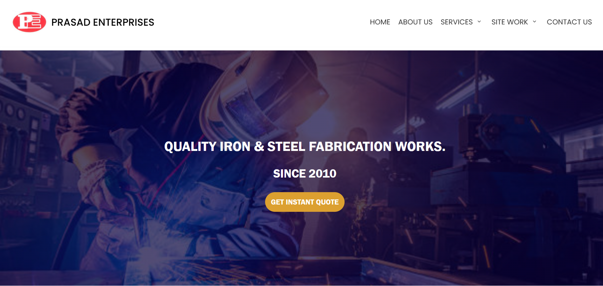
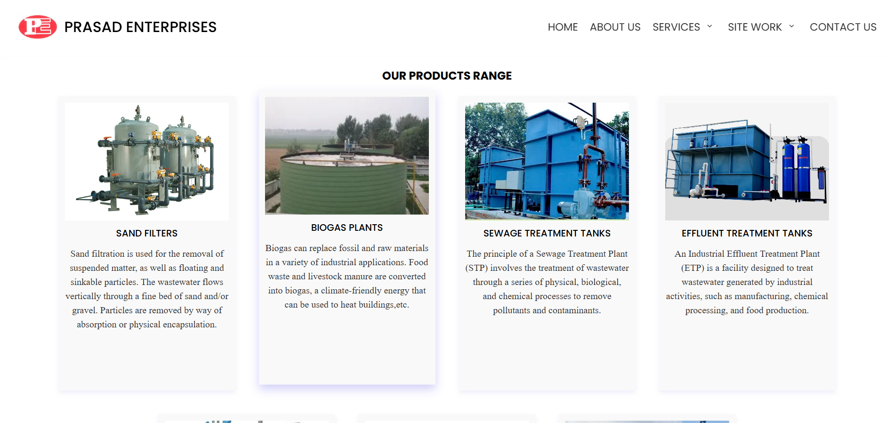
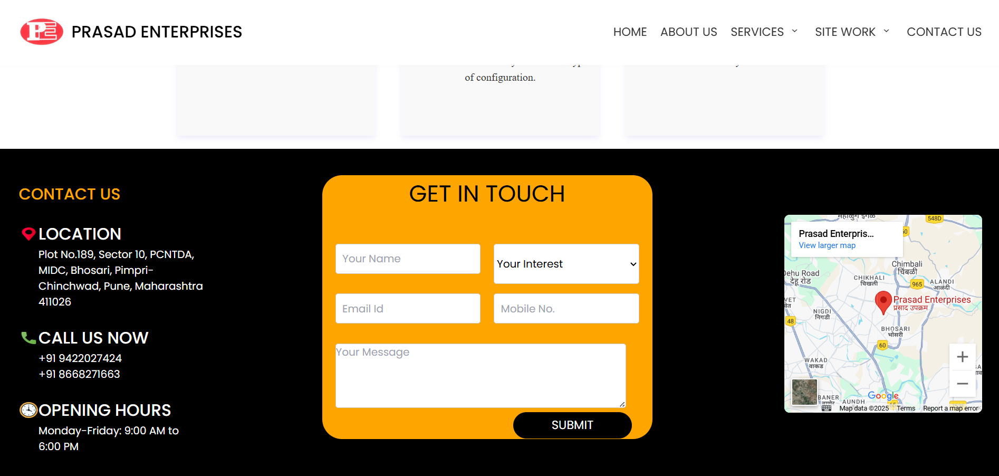

# 🏗️ Fabrication Service Website - Prasad Enterprises

A modern, responsive, and visually appealing website built for a fabrication service business using **React.js** and **CSS**. This project showcases services, client testimonials, contact forms, and more – all wrapped in a clean, intuitive UI to help boost client engagement and lead generation.

## 🚀 Features

- ✨ **Responsive Design** – Fully mobile-friendly using CSS.
- 📄 **Service Pages** – Detailed sections highlighting fabrication services.
- 🧑‍💼 **About Us** – Introduction to the team and company mission.
- 📞 **Contact Form** – Functional form with validation to reach out.
- 🔍 **SEO-Optimized** – Semantic HTML and proper metadata for better visibility.
- ⚡ **Fast & Lightweight** – Built with Vite for rapid load times.

## 🛠️ Tech Stack

- **Frontend:** [React.js](https://reactjs.org/)
- **Styling:** [CSS](https://tailwindcss.com/)
- **Build Tool:** [Vite](https://vitejs.dev/)


## 📸 Screenshots

### 🏠 Home Page


### 🛠️ Services Page


### 📞 Contact Page



## 📦 Installation

```bash
# Clone the repository
git clone https://github.com/VikasPrasad27/prasadenterprises.git

# Navigate into the project directory
cd prasadenterprises

# Install dependencies
npm install

# Start the development server
npm run dev
```
## DESIGNED AND DEVELPOED BY VIKAS PRASAD

